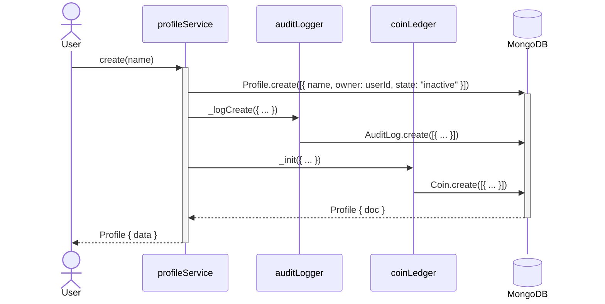
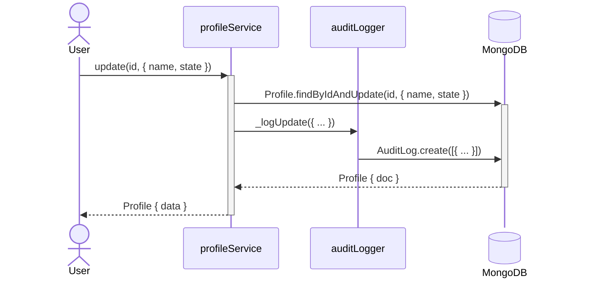
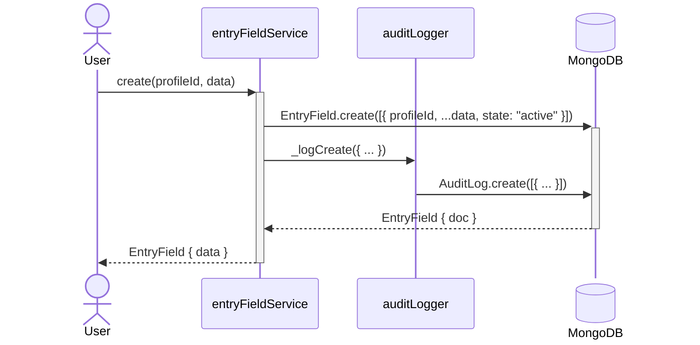
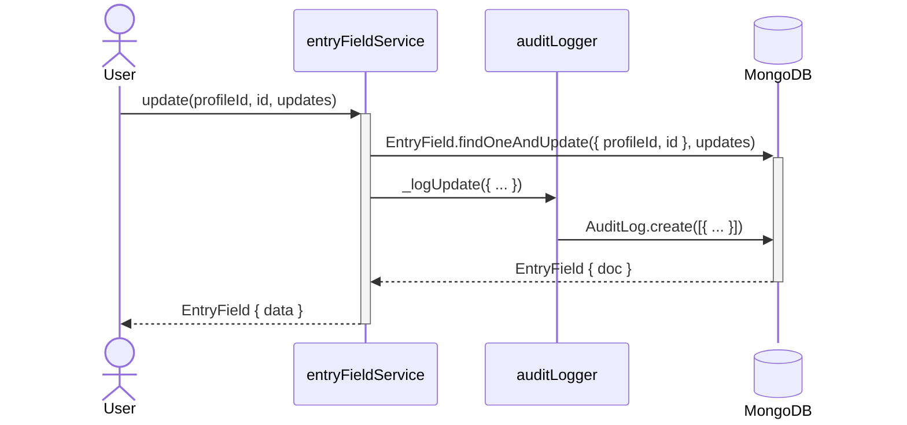
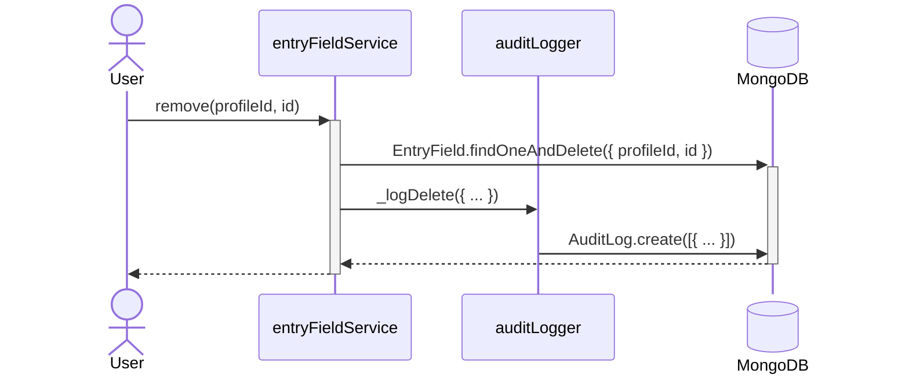
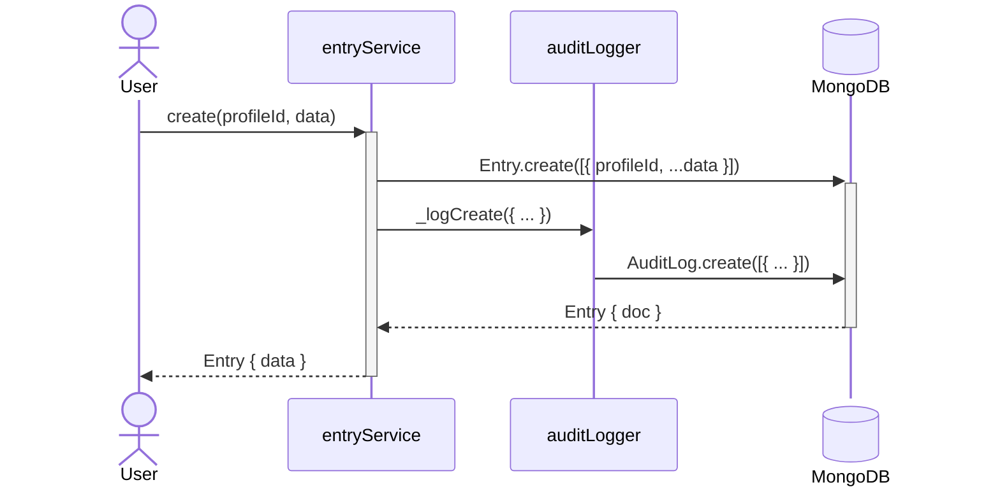
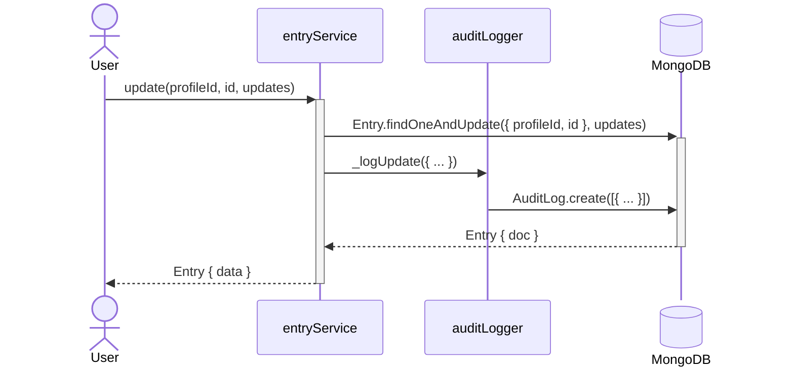
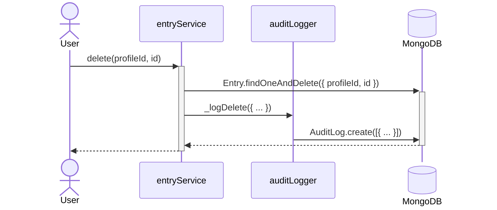
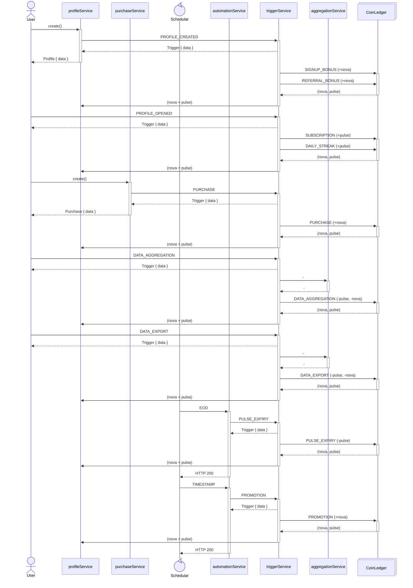

# Nomenclature

### MongoDB

- Database - snake_case
- Collection - snake_case, plural nouns
- Field - camelCase
- consider profileId as sub-collection name
- Attributes == Entry Fields == Book, Head, Tag, Source
- Attribute Items = Book Collection, Head Collection, Tag Collection, Source Collection

### Environments (Stages)

- Development (**alpha**)
  - Local Machine / GitHub Codespaces
  - GCP `zero65-test` → Firebase Authentication
  - MongoDB Atlas → Project `Zero65 Test` → DB `track`
- Testing (**beta**)
  - GCP `zero65-test` → Google Cloud Build, Firebase Hosting, Cloud Run
  - GCP `zero65-test` → Firebase Authentication
  - MongoDB → Project `Zero65 Test` → DB `track`
- Staging (**gamma**)
  - Local Machine / GitHub Codespaces
  - GCP `zero65-track` → Firebase Authentication
  - MongoDB → Project `Zero65 Prod` → DB `track`
- Production (**prod**)
  - GCP `zero65-track` → Google Cloud Build, Firebase Hosting, Cloud Run
  - GCP `zero65-track` → Firebase Authentication
  - MongoDB Atlas → Project `Zero65 Prod` → DB `track`

# Development

There is no difference between development and production in Node.js, i.e., there are no specific settings you need to apply to make Node.js work in a production configuration. However, a few libraries in the npm registry recognize using the `NODE_ENV` variable and default it to a `development` setting. Always run your Node.js with the `NODE_ENV=production` set.

function names starting with '\_' are meant to be used internally, i.e. not called by any controller, to be called only by other services. private functions typically have session as one of the argument

### NodeJs Version (22)

- Devcontainer
- GitHub Workflows
- Dockerfile / cloudbuild.yaml

### MongoDB OCC

- `services`/`triggerService`

### Checklist

- Users
- Profiles
  - [x] CRU APIs
  - [ ] Disallow un-deleting after 30 days
- Core Components
  - Boooks, Heads, Tags, Sources
    - [x] CRUD APIs
  - Folders
    - [x] CRUD APIs
  - Groups
    - [x] CRUD APIs
  - Entries
    - [x] CRUD APIs
  - [x] Do **not** check if nested `docId` exists and active
  - [ ] Allow only Read APIs for `inactive` and `disabled` Profiles
  - [ ] Disallow all APIs for `deleted` Profiles
- Audit Logs
  - [ ] Read APIs
- Purchase
- Promotions
- Offline Processing
  - Automations
    - [ ] Clean-up `deleted` Profiles after wating period
  - Triggers
    - [ ] Create & Read APIs
- Feature Components
  - Aggregations (on Entry Collection)
    - [ ] Read APIs
  - Coin Ledger
    - [ ] Read APIs
  - [ ] Allow only Read APIs for `inactive` and `disabled` Profiles
  - [ ] Disallow all APIs for `deleted` Profiles

# Sequence Diagrams

### POST /api/profiles

### PATCH /api/profiles

### POST /api/profiles/:profileId/(books|heads|tags|sources)

### PATCH /api/profiles/:profileId/(books|heads|tags|sources)

### DELETE /api/profiles/:profileId/(books|heads|tags|sources)

### POST /api/profiles/:profileId/entries

### PATCH /api/profiles/:profileId/entries

### DELETE /api/profiles/:profileId/entries

### Triggers, Automations & Coin Ledger

