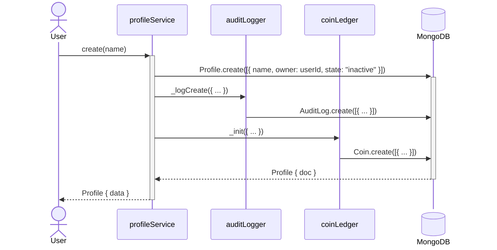
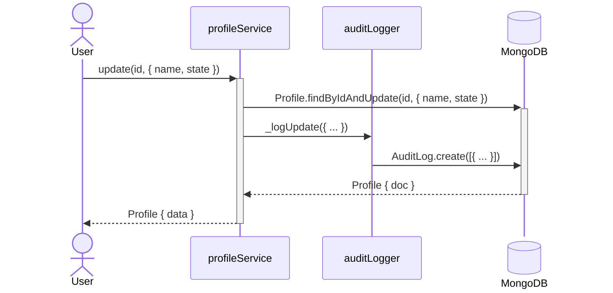
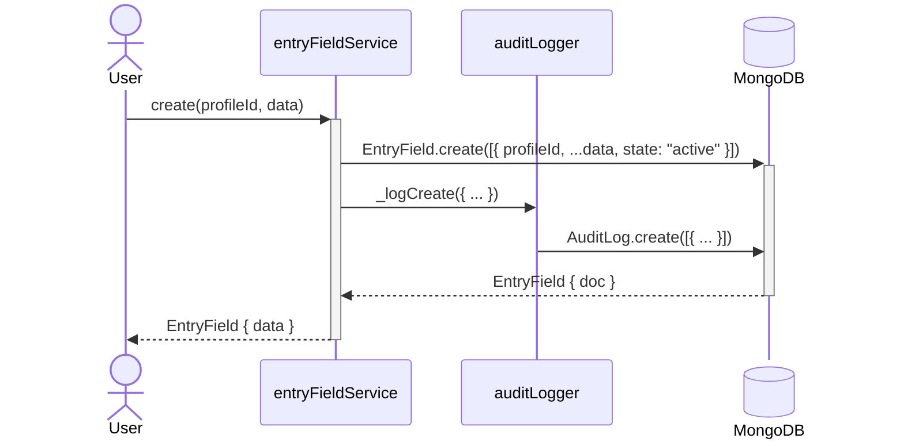
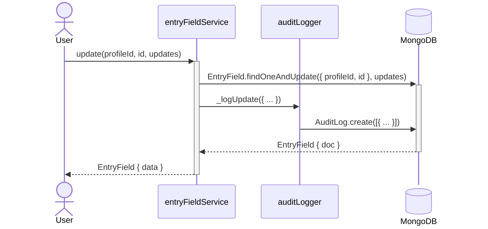
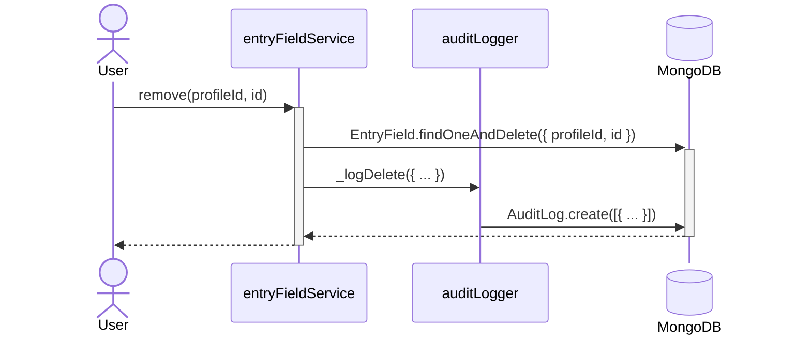
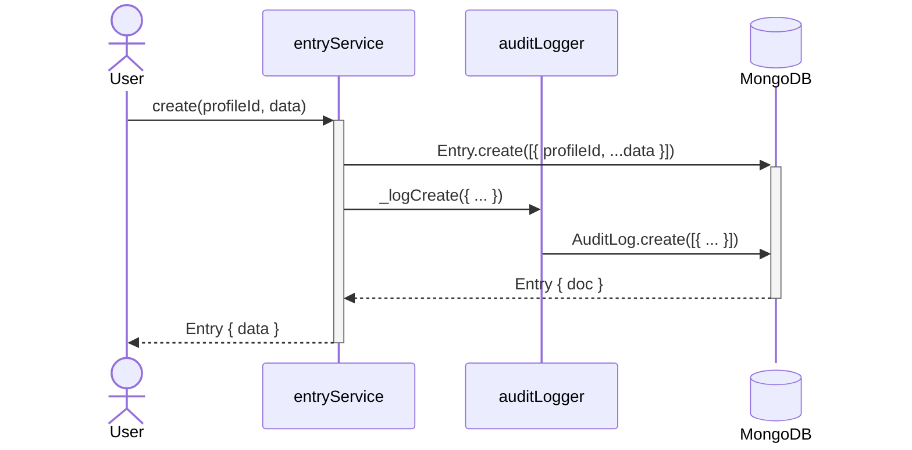
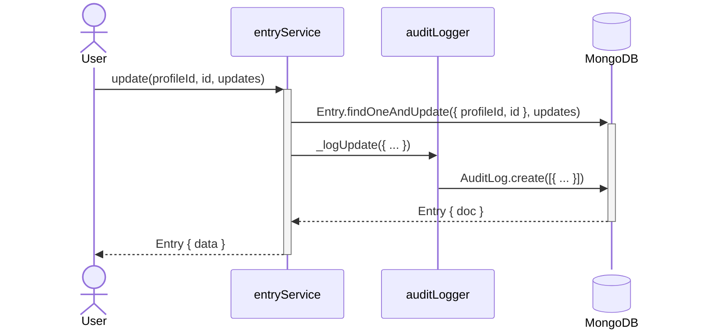
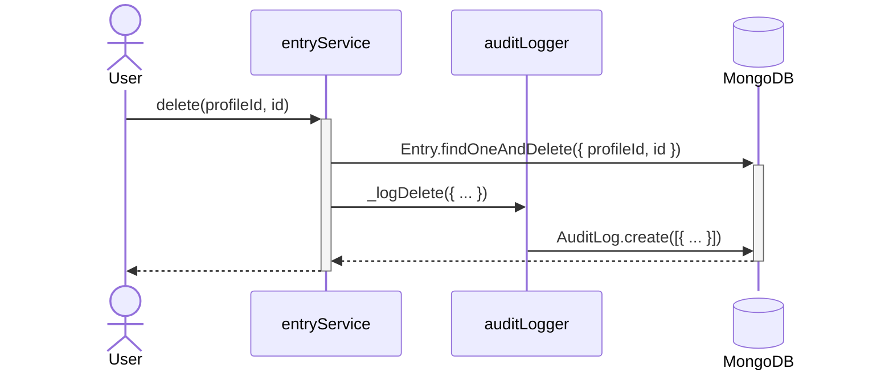
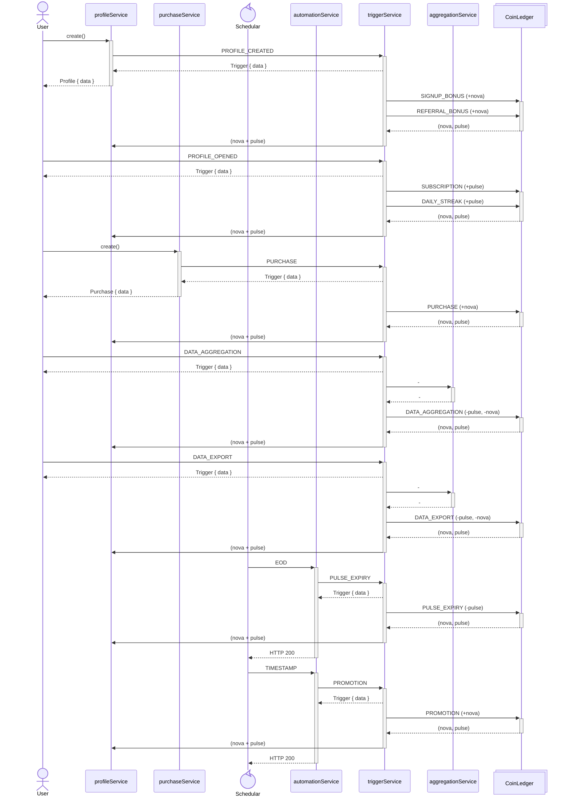

## Environments (Stages)

- Development (**alpha**)
  - Local Machine / GitHub Codespaces, .env.aplha.local
  - GCP `zero65-test` → Firebase Authentication
  - MongoDB Atlas → Project `Zero65 Test` → DB `track`
  - Commands: **npm run backend** & **npm run frontend**
- Testing (**beta**) - https://zero65-test.web.app/
  - GCP `zero65-test` → Google Cloud Build, Firebase Hosting, Cloud Run, Secret Manager
  - GCP `zero65-test` → Firebase Authentication
  - MongoDB Atlas → Project `Zero65 Test` → DB `track`
  - Commands: **STAGE=beta npm run frontend**
- Staging (**gamma**)
  - Local Machine / GitHub Codespaces, .env.gamma.local
  - GCP `zero65-track` → Firebase Authentication
  - MongoDB Atlas → Project `Zero65 Prod` → DB `track`
  - Commands: **STAGE=gamma npm run backend** & **STAGE=gamma npm run frontend**
- Production (**prod**) - https://track-v5.web.app/
  - GCP `zero65-track` → Google Cloud Build, Firebase Hosting, Cloud Run, Secret Manager
  - GCP `zero65-track` → Firebase Authentication
  - MongoDB Atlas → Project `Zero65 Prod` → DB `track`
  - Commands: **STAGE=prod npm run frontend**

## MongoDB

- Naming Convension
  - Database - snake_case
  - Collection - snake_case, plural nouns
  - Field - camelCase
- Treat **profileId** as sub-collection name
- Attributes == Book, Head, Tag, Source
- Organizers == Group, Folder
- Attribute Items = Book Collection, Head Collection, Tag Collection, Source Collection

## NodeJs Version (24)

- Devcontainer
- GitHub Workflows
- Dockerfile
- Terraform

## Backend Development

- There is no difference between development and production in Node.js, i.e., there are no specific settings you need to apply to make Node.js work in a production configuration. However, a few libraries in the npm registry recognize using the `NODE_ENV` variable and default it to a `development` setting. Always run your Node.js with the `NODE_ENV=production` set.

- function names starting with '\_' are meant to be used internally, i.e. not called by any controller, to be called only by other services. private functions typically have session as one of the argument

## Project Guidelines (Checklist)

### User Management

- Users
  - [x] Managed by Firebase Authentication
- `devices`
  - [x] Logged-in User always claims the device

### Core System

- `profiles`
  - [x] CRU APIs
  - [ ] Disallow un-deleting after grace period
  - [ ] Clean-up **deleted** Profiles after grace period
- Attributes & Organizers
  - `boooks`, `heads`, `tags`, `sources`
    - [x] CRUD APIs
  - `groups`
    - [x] CRUD APIs
  - `folders`
    - [x] CRUD APIs
  - [ ] Do not allow deleting if in use
  - [ ] Disallow un-deleting after grace period
  - [ ] Clean-up **deleted** items after grace period
  - [ ] Allow only Read APIs for **inactive** and **disabled** Profiles
  - [ ] Disallow all APIs for **deleted** Profiles
  - [ ] Allow Read APIs for SYSTEM_USER_ID **template** Profiles
- `entries`
  - [x] CRUD APIs
  - [x] Do **not** check if nested **docId** exists and **active**
  - [ ] Disallow un-deleting after grace period
  - [ ] Clean-up **deleted** items after grace period
  - [ ] Allow only Read APIs for **inactive** and **disabled** Profiles
  - [ ] Disallow all APIs for **deleted** Profiles
  - [ ] Allow Read APIs for SYSTEM_USER_ID **template** Profiles
- `audit_logs`
  - [ ] Read APIs

### Aggregations & Cleanups

- Offline Processing
  - `triggers`
    - [x] Create & Process APIs
    - [x] FCM Integration
  - Automations
    - [ ] Clean-up **deleted** Profiles after wating period
  - [ ] Allow only Read APIs for **inactive** and **disabled** Profiles
  - [ ] Disallow all APIs for **deleted** Profiles
  - [ ] Allow all APIs for SYSTEM_USER_ID **template** Profiles
- Feature Components
  - `aggregations` (on Entry Collection)
    - [x] Read APIs
  - `coins`
    - [ ] Read APIs
  - [ ] Allow only Read APIs for **inactive** and **disabled** Profiles
  - [ ] Disallow all APIs for **deleted** Profiles
  - [ ] Allow all APIs for SYSTEM_USER_ID **template** Profiles

### Monetisation

- Purchase
- Promotions

   

# Sequence Diagrams

### POST /api/profiles

```mermaid
sequenceDiagram
    actor User
    participant profileService
    participant auditLogger
    participant coinLedger
    participant MongoDB@{ "type" : "database" }

    User->>+profileService: create(name)

    profileService->>+MongoDB: Profile.create([{ name, owner: userId, state: "inactive" }])

    profileService->>auditLogger: _logCreate({ ... })
    auditLogger->>MongoDB: AuditLog.create([{ ... }])

    profileService->>coinLedger: _init({ ... })
    coinLedger->>MongoDB: Coin.create([{ ... }])

    MongoDB-->>-profileService: Profile { doc }
    profileService-->>-User: Profile { data }

```

### PATCH /api/profiles

```mermaid
sequenceDiagram
    actor User
    participant profileService
    participant auditLogger
    participant MongoDB@{ "type" : "database" }

    User->>+profileService: update(id, { name, state })

    profileService->>+MongoDB: Profile.findByIdAndUpdate(id, { name, state })

    profileService->>auditLogger: _logUpdate({ ... })
    auditLogger->>MongoDB: AuditLog.create([{ ... }])

    MongoDB-->>-profileService: Profile { doc }
    profileService-->>-User: Profile { data }

```

### POST /api/profiles/:profileId/(books|heads|tags|sources)

```mermaid
sequenceDiagram
    actor User
    participant entryFieldService
    participant auditLogger
    participant MongoDB@{ "type" : "database" }

    User->>+entryFieldService: create(profileId, data)

    entryFieldService->>+MongoDB: EntryField.create([{ profileId, ...data, state: "active" }])

    entryFieldService->>auditLogger: _logCreate({ ... })
    auditLogger->>MongoDB: AuditLog.create([{ ... }])

    MongoDB-->>-entryFieldService: EntryField { doc }
    entryFieldService-->>-User: EntryField { data }

```

### PATCH /api/profiles/:profileId/(books|heads|tags|sources)

```mermaid
sequenceDiagram
    actor User
    participant entryFieldService
    participant auditLogger
    participant MongoDB@{ "type" : "database" }

    User->>+entryFieldService: update(profileId, id, updates)

    entryFieldService->>+MongoDB: EntryField.findOneAndUpdate({ profileId, id }, updates)

    entryFieldService->>auditLogger: _logUpdate({ ... })
    auditLogger->>MongoDB: AuditLog.create([{ ... }])

    MongoDB-->>-entryFieldService: EntryField { doc }
    entryFieldService-->>-User: EntryField { data }

```

### DELETE /api/profiles/:profileId/(books|heads|tags|sources)

```mermaid
sequenceDiagram
    actor User
    participant entryFieldService
    participant auditLogger
    participant MongoDB@{ "type" : "database" }

    User->>+entryFieldService: remove(profileId, id)

    entryFieldService->>+MongoDB: EntryField.findOneAndDelete({ profileId, id })

    entryFieldService->>auditLogger: _logDelete({ ... })
    auditLogger->>MongoDB: AuditLog.create([{ ... }])

    MongoDB-->>-entryFieldService:
    entryFieldService-->>-User:

```

### POST /api/profiles/:profileId/entries

```mermaid
sequenceDiagram
    actor User
    participant entryService
    participant auditLogger
    participant MongoDB@{ "type" : "database" }

    User->>+entryService: create(profileId, data)

    entryService->>+MongoDB: Entry.create([{ profileId, ...data }])

    entryService->>auditLogger: _logCreate({ ... })
    auditLogger->>MongoDB: AuditLog.create([{ ... }])

    MongoDB-->>-entryService: Entry { doc }
    entryService-->>-User: Entry { data }

```

### PATCH /api/profiles/:profileId/entries

```mermaid
sequenceDiagram
    actor User
    participant entryService
    participant auditLogger
    participant MongoDB@{ "type" : "database" }

    User->>+entryService: update(profileId, id, updates)

    entryService->>+MongoDB: Entry.findOneAndUpdate({ profileId, id }, updates)

    entryService->>auditLogger: _logUpdate({ ... })
    auditLogger->>MongoDB: AuditLog.create([{ ... }])

    MongoDB-->>-entryService: Entry { doc }
    entryService-->>-User: Entry { data }

```

### DELETE /api/profiles/:profileId/entries

```mermaid
sequenceDiagram
    actor User
    participant entryService
    participant auditLogger
    participant MongoDB@{ "type" : "database" }

    User->>+entryService: delete(profileId, id)

    entryService->>+MongoDB: Entry.findOneAndDelete({ profileId, id })

    entryService->>auditLogger: _logDelete({ ... })
    auditLogger->>MongoDB: AuditLog.create([{ ... }])

    MongoDB-->>-entryService:
    entryService-->>-User:

```

### Triggers, Automations & Coin Ledger

```mermaid
sequenceDiagram
    actor User
    participant profileService
    participant purchaseService
    participant Schedular@{ "type" : "control" }
    participant automationService
    participant triggerService
    participant aggregationService
    participant CoinLedger@{ "type" : "collections" }

    User->>+profileService:create()
    profileService->>+triggerService:PROFILE_CREATED
    triggerService-->>profileService:Trigger { data }
    profileService-->>-User:Profile { data }
    triggerService->>+CoinLedger:SIGNUP_BONUS (+nova)
    triggerService->>CoinLedger:REFERRAL_BONUS (+nova)
    CoinLedger-->>-triggerService:(nova, pulse)
    triggerService->>-profileService:(nova + pulse)

    User->>+triggerService:PROFILE_OPENED
    triggerService-->>User:Trigger { data }
    triggerService->>+CoinLedger:SUBSCRIPTION (+pulse)
    triggerService->>CoinLedger:DAILY_STREAK (+pulse)
    CoinLedger-->>-triggerService:(nova, pulse)
    triggerService->>-profileService:(nova + pulse)

    User->>+purchaseService:create()
    purchaseService->>+triggerService:PURCHASE
    triggerService-->>purchaseService:Trigger { data }
    purchaseService-->>-User:Purchase { data }
    triggerService->>+CoinLedger:PURCHASE (+nova)
    CoinLedger-->>-triggerService:(nova, pulse)
    triggerService->>-profileService:(nova + pulse)

    User->>+triggerService:DATA_AGGREGATION
    triggerService-->>User:Trigger { data }
    triggerService->>+aggregationService:-
    aggregationService-->>-triggerService:-
    triggerService->>+CoinLedger:DATA_AGGREGATION (-pulse, -nova)
    CoinLedger-->>-triggerService:(nova, pulse)
    triggerService->>-profileService:(nova + pulse)

    User->>+triggerService:DATA_EXPORT
    triggerService-->>User:Trigger { data }
    triggerService->>+aggregationService:-
    aggregationService-->>-triggerService:-
    triggerService->>+CoinLedger:DATA_EXPORT (-pulse, -nova)
    CoinLedger-->>-triggerService:(nova, pulse)
    triggerService->>-profileService:(nova + pulse)

    Schedular->>+automationService:EOD
    automationService->>+triggerService:PULSE_EXPIRY
    triggerService-->>automationService:Trigger { data }
    triggerService->>+CoinLedger:PULSE_EXPIRY (-pulse)
    CoinLedger-->>-triggerService:(nova, pulse)
    triggerService->>-profileService:(nova + pulse)
    automationService-->>-Schedular:HTTP 200

    Schedular->>+automationService:TIMESTAMP
    automationService->>+triggerService:PROMOTION
    triggerService-->>automationService:Trigger { data }
    triggerService->>+CoinLedger:PROMOTION (+nova)
    CoinLedger-->>-triggerService:(nova, pulse)
    triggerService->>-profileService:(nova + pulse)
    automationService-->>-Schedular:HTTP 200

```
