# Track Backend — Architecture Overview

> Generated from source analysis of `/workspaces/track/backend/src`

---

## Keeping This Document Updated

A `.git/hooks/post-commit` hook watches `backend/src/` and prints a reminder after any commit that touches it.
When you see the reminder, open **Copilot Chat** and paste the prompt below:

> *Review the backend source files that changed in the last git commit and update `docs/backend-architecture.md` to reflect any changes — new routes, models, services, trigger types, coin logic, or aggregation pipelines. Keep diagram syntax valid and preserve all existing sections that are still accurate.*

**Quick reference — which section to update for common changes:**

| Change | Section(s) to update |
|--------|----------------------|
| New route or middleware | §2 Request Lifecycle |
| New model or field | §5 Data Model, §9 ERD |
| New trigger type | §6 Trigger & Coin |
| New aggregation pipeline | §7 Aggregation Pipeline |
| New service or dependency | §8 Service Dependency Map |
| FCM / Firebase changes | §3 User & Device Management |
| Profile state or access change | §4 Profile Access Control |

---

## Sections Overview

| # | Section | Diagram type | What it shows |
|---|---------|-------------|---------------|
| 1 | **System Overview** | Flowchart | Frontend → Cloud Run → Firebase Auth/FCM → MongoDB |
| 2 | **Request Lifecycle & Middleware Chain** | Flowchart | Public vs auth-only vs profile-scoped routes; `authMiddleware` → `accessMiddleware` gate |
| 3 | **User & Device Management** | Sequence diagram | Device registration (anonymous), claim after login, FCM push dispatch + token deactivation on error |
| 4 | **Profile Access Control** | Flowchart | Profile state machine (`inactive → active → disabled/deleted`) and the access-check logic (owner/editor/viewer) |
| 5 | **Profile, Attributes, Entries & Audit Logs** | Flowchart + Sequence | Data model relationships (Books/Heads/Tags/Sources → Entries → Groups/Folders) and the atomic write pattern (transaction → audit log in same Mongoose session) |
| 6 | **Trigger & Coin System** | Flowchart + Sequence | Trigger state machine with OCC safety, coin ledger (pulse/nova), cron processing loop with FCM state broadcasts |
| 7 | **Aggregation Pipeline** | Flowchart | Idempotent trigger queuing → cron processing → named MongoDB pipelines → result stored for read |
| 8 | **Service Dependency Map** | Flowchart | Which services call which (controllers → services → Firebase/MongoDB/LRU cache) |
| 9 | **Data Model Entity Relationships** | Flowchart | All collections, their key fields, and mandatory vs optional FK relationships |

---

## 1. System Overview

High-level view of all major subsystems and how they relate to each other.

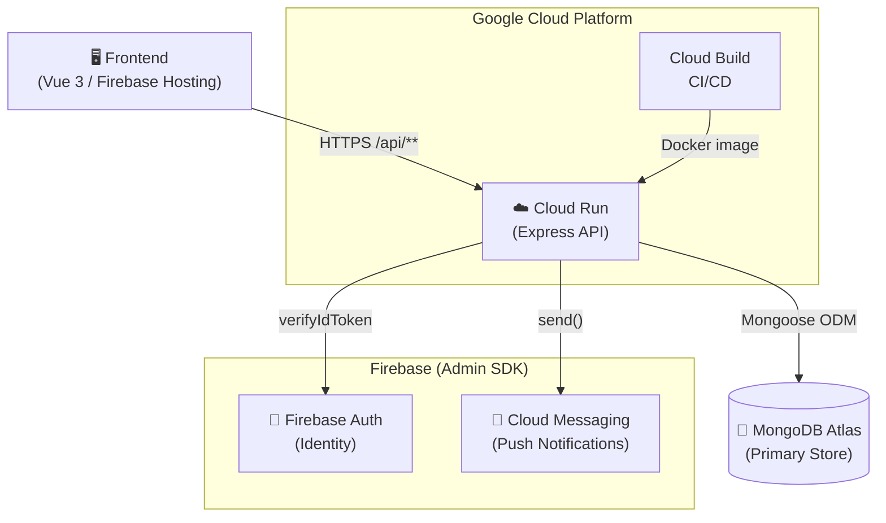

---

## 2. Request Lifecycle & Middleware Chain

Every request passes through two gates before reaching a controller.

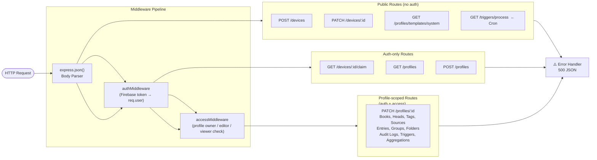

---

## 3. User & Device Management

How a device gets registered and linked to a Firebase user, and how FCM push notifications are dispatched.

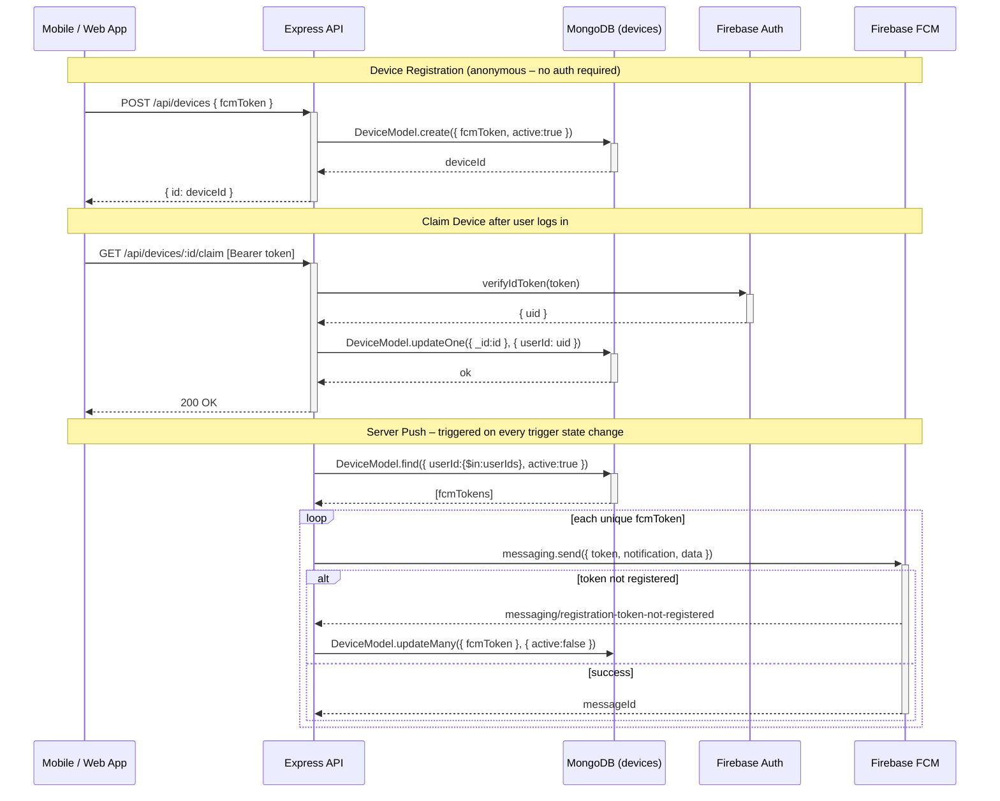

---

## 4. Profile Access Control

Profiles are the top-level container for all financial data. A user can be owner, editor, or viewer.

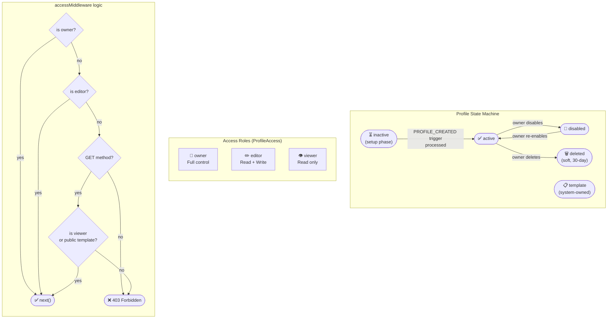

---

## 5. Profile, Attributes, Entries & Audit Logs

The core data model — everything that belongs to a profile.

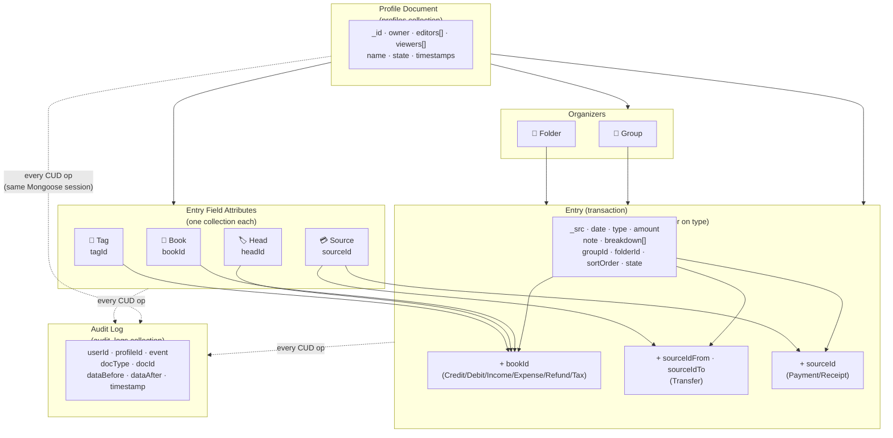

### Write Pattern (Transaction + Audit)

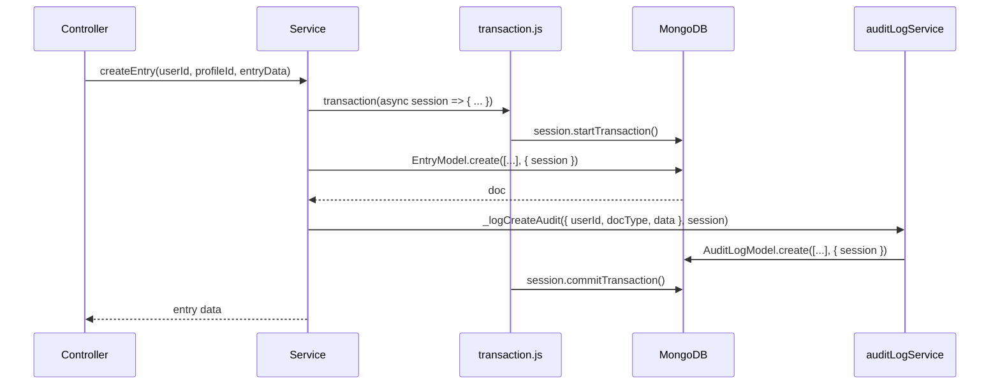

---

## 6. Trigger & Coin System

Triggers are async jobs queued in MongoDB and processed by a cron-invoked endpoint. Coin deductions happen atomically inside the same Mongoose session as the aggregation result write.

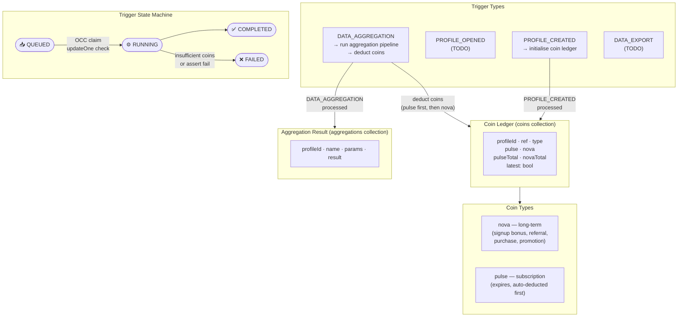

### Trigger Processing Flow (Cron)

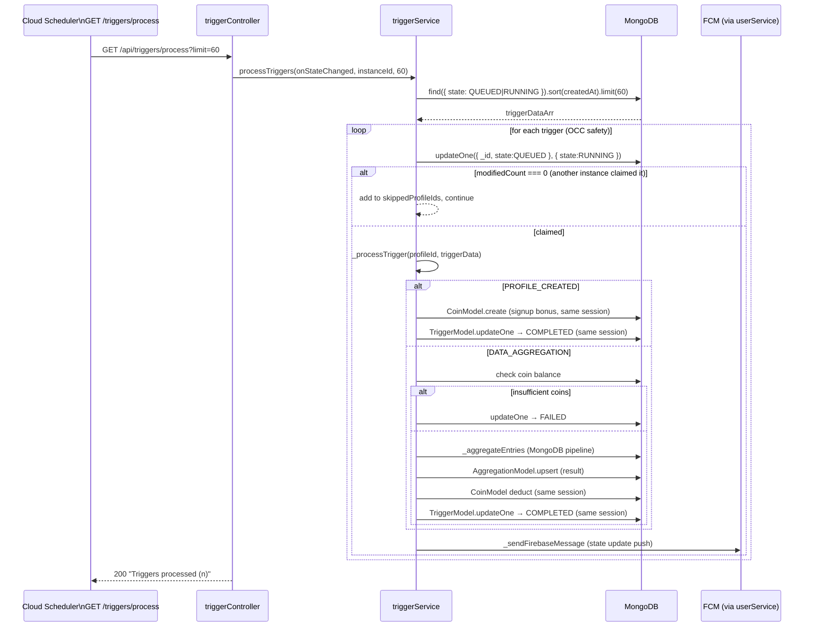

---

## 7. Aggregation Pipeline

Named aggregation pipelines that compute financial summaries over entries.

```mermaid
flowchart LR
    subgraph Request["Client Request"]
        R1["POST /profiles/:id/triggers/data-aggregation\n{ aggregationName, entryType,\nbookId, headId, tagId, sourceId }"]
    end

    subgraph TriggerCreate["1. Queue Trigger"]
        TC["triggerService\n.createDataAggregationTrigger()\n\nIdempotent: returns existing\nQUEUED/RUNNING trigger\nif one already exists"]
    end

    subgraph TriggerProcess["2. Cron Processes Trigger"]
        TP["triggerService\n._processDataAggregationTrigger()\n\n1. entryService._aggregateEntries()\n2. aggregationService._setAggregationResult()\n3. coinService._deductCoinsFromLedger()\n(atomic transaction)"]
    end

    subgraph AggregationPipelines["Named Aggregation Pipelines\n(config/aggregations/)"]
        AP1["amounts_by_book"]
        AP2["amounts_by_type"]
        AP3["amounts_by_type_book_month"]
        AP4["amounts_by_type_head_tag_month"]
        AP5["balances_by_book"]
        AP6["balances_by_source"]
        AP7["counts_by_head_tag"]
        AP8["amounts_for_a_book/head/tag/source"]
        AP9["... etc."]
    end

    subgraph Read["3. Read Result"]
        RR["GET /profiles/:id/aggregations/:name/result\naggregationService.getAggregation()"]
    end

    Request --> TriggerCreate
    TriggerCreate --> TriggerProcess
    TriggerProcess --> AggregationPipelines
    AggregationPipelines -->|"result stored\nin aggregations collection"| Read
```

---

## 8. Service Dependency Map

Which services call which other services (internal `_` functions shown).

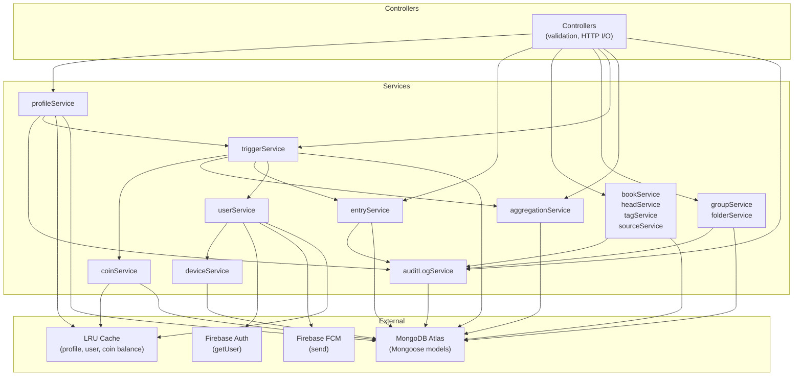

---

## 9. Data Model Entity Relationships

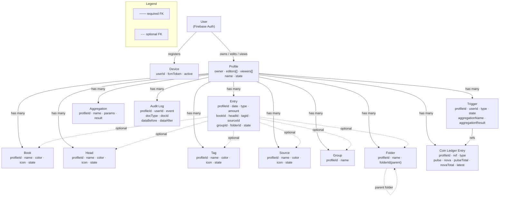
