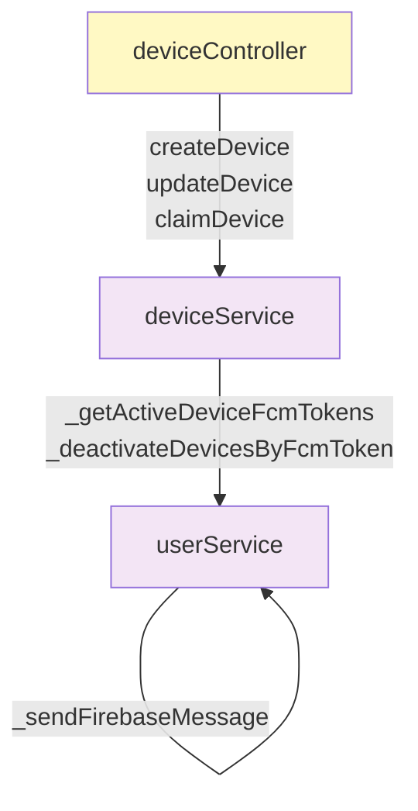
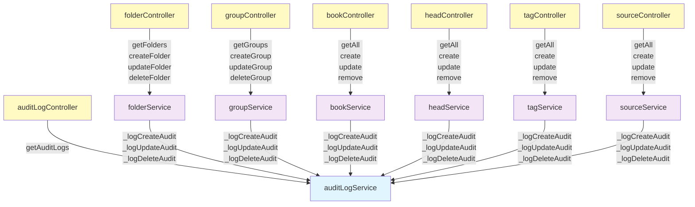
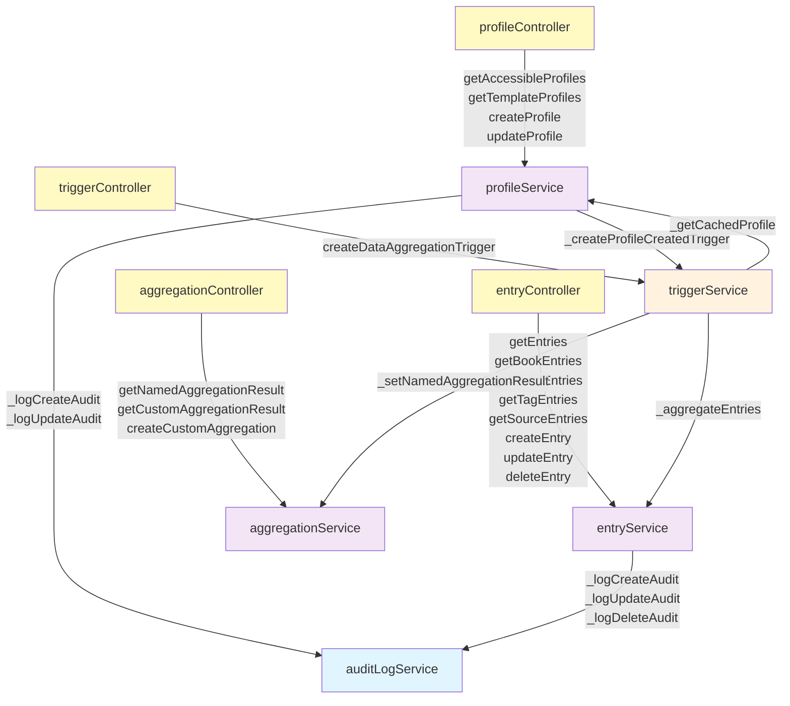
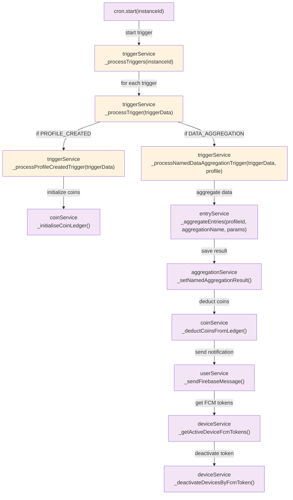

# Track Backend Service Dependency Diagrams

## Part 1: Device & User Management Controllers

## Part 2: Entry Attributes & Supporting CRUD

## Part 3: Core Entry CRUD & Trigger Management

## Part 4: Offline Trigger Processing

